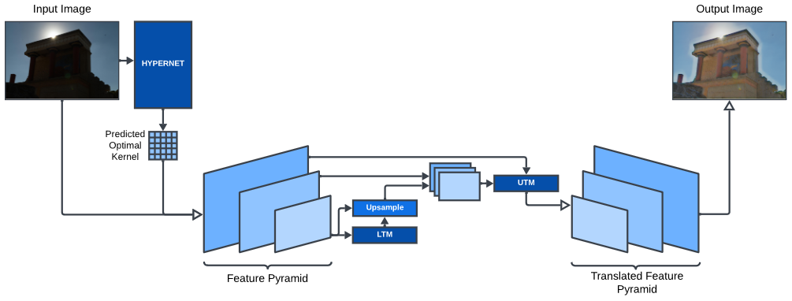
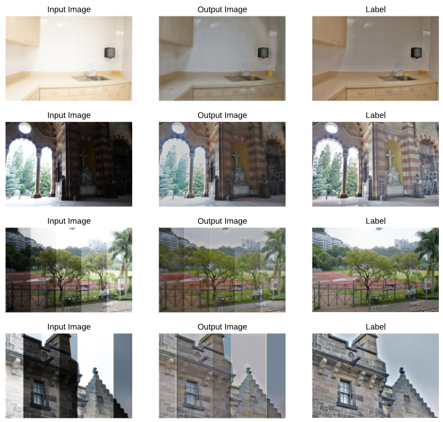

# HipyrNet

Pytorch code for our [paper](https://openaccess.thecvf.com/content/WACV2025W/ImageQuality/papers/Rathore_HipyrNet_Hypernet-Guided_Feature_Pyramid_network_for_mixed-exposure_correction_WACVW_2025_paper.pdf)

This paper was accepted at WACV 2025 Workshop - 4th Workshop on Image/Video/Audio Quality in Computer Vision and Generative AI.

<br>
<div align="center">
  
</div>
<br>

Recent advancements in image translation for enhancing mixed-exposure images have demonstrated the transformative potential of deep learning algorithms. However, addressing extreme exposure variations in images remains a significant challenge due to the inherent complexity and contrast inconsistencies across regions. Current methods often struggle to adapt effectively to these variations, resulting in suboptimal performance. In this work, we propose HipyrNet, a novel approach that integrates a HyperNetwork within a Laplacian Pyramid-based framework to tackle the challenges of mixed-exposure image enhancement. The inclusion of a HyperNetwork allows the model to adapt to these exposure variations. HyperNetworks dynamically generate weights for another network, allowing dynamic changes during deployment. In our model, the HyperNetwork employed is used to predict optimal kernels for Feature Pyramid decomposition, which enables a tailored and adaptive decomposition process for each input image. Our enhanced translational network incorporates multiscale decomposition and reconstruction, leveraging dynamic kernel prediction to capture and manipulate features across varying scales. Extensive experiments demonstrate that HipyrNet outperforms existing methods, particularly in scenarios with extreme exposure variations, achieving superior results in both qualitative and quantitative evaluations. Our approach sets a new benchmark for mixed-exposure image enhancement, paving the way for future research in adaptive image translation.
<br>

## Visualisations
<div align="center">
  
</div>
<br>

## Get Started
```
$ git clone https://github.com/aravindshenoy13/hipyrnet.git
$ cd hipyrnet
```

## Train & Eval
```
$ python -m src.train
```

## Citation

If you find this method and/or code useful, please consider citing -

@misc{rathore2025hipyrnethypernetguidedfeaturepyramid,
      title={HipyrNet: Hypernet-Guided Feature Pyramid network for mixed-exposure correction}, 
      author={Shaurya Singh Rathore and Aravind Shenoy and Krish Didwania and Aditya Kasliwal and Ujjwal Verma},
      year={2025},
      eprint={2501.05195},
      archivePrefix={arXiv},
      primaryClass={cs.CV},
      url={https://arxiv.org/abs/2501.05195}, 
}
